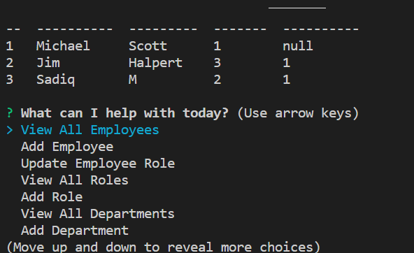

# employee-tracker
## Description
This command-line application from helps to manage a company's employee database, using Node.js, Inquirer, and MySQL.

## Table of Contents
* [Usage](#Usage)
* [Video-Link](#Video-Link)
* [Credits/Citations](#Credits/Citations)
* [Features](#Features)
* [Applications-Used](#Applications-Used)
* [Screenshots](#Screenshots)

## Usage
* GIVEN a command-line application that accepts user input
* WHEN I start the application
* THEN I am presented with the following options: view all departments, view all roles, view all employees, add a department, add a role, add an employee, and update an employee role
* WHEN I choose to view all departments
* THEN I am presented with a formatted table showing department names and department ids
* WHEN I choose to view all roles
* THEN I am presented with the job title, role id, the department that role belongs to, and the salary for that role
* WHEN I choose to view all employees
* THEN I am presented with a formatted table showing employee data, including employee ids, first names, last names, job titles, departments, salaries, and managers that the employees report to
* WHEN I choose to add a department
* THEN I am prompted to enter the name of the department and that department is added to the database
* WHEN I choose to add a role
* THEN I am prompted to enter the name, salary, and department for the role and that role is added to the database
* WHEN I choose to add an employee
* THEN I am prompted to enter the employee’s first name, last name, role, and manager, and that employee is added to the database
* WHEN I choose to update an employee role
* THEN I am prompted to select an employee to update and their new role and this information is updated in the database

## Video-Link
**[Click here for video link](https://youtu.be/Nfc8NvGV-LQ)**

## Credits/Citations
* Tutor Abdullah for helping me fix bugs in my project
* TA Charlie for helping with .env
* Module 12 lessons
* Module 9 lessons on Node.js

## Features
The user can not only see existing employee names, roles, and departments, but also update the roles and departments and create new ones.

## Applications-Used
* Node.js
* Inquirer
* Markdown
* MySQL

## Screenshots
See below screenshots of generated Readme

